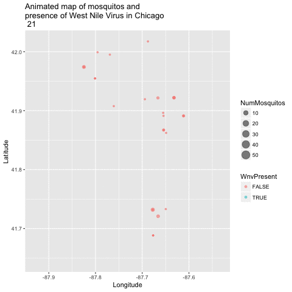

```{r setup, include=FALSE}
knitr::opts_chunk$set(echo = TRUE)
knitr::opts_knit$set(root.dir = '../')
```

This project will attempt to predict the likelihood of a positive test for West Nile Virus (WNV) in mosquitos captured using traps around Chicago, IL. The data sets originate from the Kaggle competition, [West Nile Virus Prediction](https://www.kaggle.com/c/predict-west-nile-virus). 

The analysis will follow an iterative approach to finding a production model for West Nile forecasting. There are several data science iterative methods, and I will use the [CRISP](./images/CRISP.png) model for organizing this project. Additionally, this analysis conforms to reproducible research standards and can be reconstructed from source files available at my [GitHub](https://github.com/kahultman/west-nile-virus) repository.

# CRISP Iteration 1

## Business Understanding 

The goal for this project is to develop a predictive model that will forecast the probability of WNV presense in 138 mosquito traps around Chicago over the course of a season. WNV is a communicable disease that is spread through its most common vector, mosquitos. Most people infected with WNV develop no symtoms, but 1% will develop neurological symptoms including headache, high fever, neck stiffness, disorientation, coma, tremors, seizures, or paralysis, according to the [CDC](https://www.cdc.gov/westnile/index.html). There are no medical treatments or cures for WNV, so preventative measures are required to reduce infection to the human population. Local community methods of mosquito control include reduction of larval habitats and applying insecticides targetting larvae or adult mosquitoes.  

Being able to predict the most likely sites of WNV outbreak is highly valuable to reduce the financial and human cost of over-application of insecticides. This project will focus on developing a predictive model based on geographic information, weather conditions, presense of mosquito species, and historical trends of mosquito populations and WNV presense in the Chicago area.   

## Data Understanding 

Kaggle supplies five data sets for the competition, three of which can be used in model training. The train.csv file includes several variables associated with each West Nile Virus test including the trap id, geo-coordinates, date, species of mosquito present, number of mosquitos present, and a binary variable indicating the presence or absence of West Nile Virus (WnvPresent), our target variable. The test.csv contains all of the same features as the train.csv file except the number of mosquitos present and the target WnvPresent variable. These data sets were obtained from West Nile Virus testing period between 2007 and 2014 with the training set containing the odd years and the test set containing the even years. The weather.csv file contains historic weather data collected at the O'Hare and Midway airports concurrent with the mosquito testing time period. The spray.csv file includes the date and location of chemical spraying conducted by the city during 2011 and 2013. Since this spray data set would only have a large impact during one of the training years, I did not include the spray data in any of my models. For the weather data, since the differences in variables between O'Hare and Midway were generally small, I chose to  use only the O'Hare data for all traps, rather than compute the closest station for each trap. 

One of the largest factors influencing viral load within a population is the size of the population. A larger population means there are more mosquitos who can become infected and it also increases the number of interactions between hosts, allowing faster spread of virus from individual to individual. The size of the population can be estimated from the number of mosquitos found in each trap. However, *this variable is not present in the test set*, and will need to be imputed from other variables before a final model can be fit to the presence of West Nile using population as an input. 

```{r load | plot number and wnv present}
library(plyr)
suppressMessages(library(tidyverse))
load("./data/train.RData")
load("./data/test.RData")
source("./src/functions.R")

ggplot(train, aes(x=WnvPresent, y=NumMosquitos)) + 
  geom_jitter(aes(color=WnvPresent)) + 
  ggtitle("Number of mosquitos in West Nile \nVirus negative and positive traps") + 
  xlab("West Nile Virus present in trap") + ylab("Number of mosquitos in trap")

train %>% group_by(Trap, Week) %>% 
  summarise(WNVrate = sum(WnvPresent)/n(), NumMosPer = sum(NumMosquitos)/n()) %>% 
  ggplot(aes(log2(NumMosPer), WNVrate)) + geom_point() + stat_smooth() +
  ggtitle("Scatterplot of mosquito count in traps to WNV rate") +
  xlab("Number of mosquitos in traps per week") + ylab("WNV positive rate")
```

Based on this initial data exploration, I will first try and develop a model that predicts the number of mosquitos in each trap and then use that predicted value as a variable in a model that predicts whether West Nile is present or absent. For predicting the number of mosquitos, I will first attempt using weather variables and weekly historic averages. Before modeling I examined scatterplots of various input variables agains mosquito counts, like the graph below comparing temperature to mosquito counts. 

```{r plot temp vs num}
ggplot(train, aes(x=Tavg, y=NumMosquitos)) + 
  geom_jitter() + 
  geom_smooth(method=lm) + 
  ggtitle("Number of mosquitos vs average daily temperature") + 
  xlab("Average daily temperature, degree F") + ylab("Number of mosquitos per trap")

```

## Data Preparation 

I cleaned up the weather and training data sets to impute missing values and delete non-informative columns. I next engineered several attributes from existing variables that I thought would be useful. Moving averages of temperature and precipitation, as well as weekly averages in overall mosquito counts were added to weather and training respectively. The code for variable engineering scripts (01_weather.R, 02_train.R) can be found in the src folder. 

## Modeling: Linear regression to predict mosquito population

For this first round of modeling, I will use linear regression to predict the number of mosquitos using weather data and historical averages per week. I expect that higher average temperatures and greater moisture should have a positive effect on the mosquito population.

Then I will use logistic regression to estimate the probability of the presence of West Nile Virus. 

```{r Mosquito linear regression}
lm_variables <- c("Tmax", 
                  "Tmin",
                  "Tavg",
                  "DewPoint",
                  "WetBulb",
                  "Sunrise",
                  "Sunset",
                  "PrecipTotal",
                  "ResultSpeed",
                  "ma3",
                  "ma5",
                  "ma10",
                  "precip3d",
                  "precip5d",
                  "precip10d")

lm_variables <- paste(lm_variables, collapse = "+")
fmla <- paste("NumMosquitos", lm_variables, sep = "~")

lm1 <- lm(fmla, data = train)

train$lmNumMosq <- predict(lm1, newdata = train)
test$lmNumMosq <- predict(lm1, newdata = test)

summary(lm1)
```

## Evaluate linear model for predicting mosquito number

The R^2 of the first model is 0.11, meaning that only 11% of observed mosquito population variation is explained by our weather model.To further evaluate the linear regression model, we can examine the residual errors against predicted numbers in the training data. 

```{r lm1 residual plot}
RMSE <- function(x, y){
  sqrt(sum((x-y)^2))
}

print(paste("RMSE score of lm1: ", round(RMSE(train$lmNumMosq, train$NumMosquitos), 1)))

ggplot(data = train, aes(x=lmNumMosq, y=(NumMosquitos - lmNumMosq))) + 
  geom_point(alpha = 0.05) + 
  ggtitle("Residual plot for estimating Mosquito number using linear model on weather data") +
  xlab("Predicted number of Mosquitos in training set") + 
  ylab("Residual error (Actual - Predicted)") + 
  stat_smooth(method=lm)
```

The residual plot appears to show bias in overestimating mosquitos at the low end and underestimating at the high end. However, the trend shows that this is indeed zero. Let's now include historical averages for each week in the year. We can also remove some variables that were not significantly informative. 

```{r mosquito linear regression 2}

lm_variables2 <- c("WeekAvgMos",
                  "Tavg",
                  "Tmin",
                  "WetBulb",
                  "ResultSpeed",
                  "ma5",
                  "ma10",
                  "precip5d")

lm_variables2 <- paste(lm_variables2, collapse = "+")
fmla2 <- paste("NumMosquitos", lm_variables2, sep = "~")

lm2 <- lm(fmla2, data = train)

train$lm2NumMosq <- predict(lm2, newdata = train)
test$lm2NumMosq <- predict(lm2, newdata = test)

summary(lm2)

print(paste("RMSE score of lm1: ", round(RMSE(train$lm2NumMosq, train$NumMosquitos), 1)))

ggplot(data = train, aes(x=lmNumMosq, y=(NumMosquitos - lmNumMosq))) + 
  geom_point(alpha = 0.05) + stat_smooth(method=lm) +
  ggtitle("Residual plot for estimating Mosquito number using linear model on weather data") +
  xlab("Predicted number of Mosquitos in training set") + ylab("Residual error (Actual - Predicted)") 

```

This results in an even lower R^2 value of 0.06 and a higher RMSE error score. 

# CRISP Iteration 2

## Data Understanding: Mosquito number distribution

In order to get a better estimate of mosquito counts, I next wanted to go back and examine the distribution of the Mosquito counts a bit further. 

```{r Mosquito Distribution}
par(mfcol = c(2,2))
hist(train$NumMosquitos, col = "lightblue")
qqnorm(train$NumMosquitos)
hist(log2(train$NumMosquitos), col = "lightblue")
qqnorm(log2(train$NumMosquitos))
par(mfcol = c(1,1))
```

The total number is capped at 50 mosquitos, and the distribution is centered close to zero with no negative values. Most observations have only 1 mosquito. I attempted to use log2 transformation on mosquito number but that did not improve the regression. 


## Modeling: Poisson Regression

The distribution of mosquitos looks closer to a capped Poisson distribution and this can be used to fit a general linear model. 

```{r Poisson regression}
glm1 <- glm(fmla, data = train, family = "poisson")

train$glm1NumMosq <- predict(glm1, newdata = train)
test$glm1NumMosq <- predict(glm1, newdata = test)

summary(glm1)

print(paste("RMSE score of lm1: ", round(RMSE(train$glm1NumMosq, train$NumMosquitos), 1)))

ggplot(data = train, aes(x=glm1NumMosq, y=(NumMosquitos - glm1NumMosq))) + 
  geom_point(alpha = 0.05) + stat_smooth(method = lm) + 
  ggtitle("Residual plot for estimating Mosquito number using Poisson regression model on weather data") + 
  xlab("Predicted number of Mosquitos in training set") + ylab("Residual error (Actual - Predicted)")  
```

This is much worse, as it only predicts up to 3 mosquitos per trap and appears to undercount mosquitos quite a bit. The RMSE is much higher at 1955. Thus far, the first linear regression model is the best for predicting Mosquito number on the training data. 


## Data understanding: WNV presence distribution

Moving on to predicting our target variable, the presence of West Nile Virus (WnvPresent in the data set), I will first examine the distribution of the variable. 

```{r}
table(train$WnvPresent)
WnvPresentOverall <- table(train$WnvPresent)[2] / sum(table(train$WnvPresent))
round(WnvPresentOverall, 3)
```

Finding WNV is rare, in only ~ 5% of cases. This means our classifier is unbalanced and should be kept in mind when coming up with models that accurately predict such a rare event. 

## Modeling: Logistic regression to predict WNV infection

```{r}

lgm1 <- glm(WnvPresent ~ NumMosquitos + ma10 + WetBulb + Tmin + Summer + Year, data = train, family = binomial(link = "logit"))

train$Wnv.glm.Pred <- predict(lgm1, newdata = train, type = "response")

# Use linear regression for mosquito number to approximate mosquito number in test set
test$NumMosquitos <- test$lmNumMosq
test$Wnv.glm.Pred <- predict(lgm1, newdata = test, type = "response")
glm.submission1 <- select(test, Id, WnvPresent = Wnv.glm.Pred)
write_csv(glm.submission1, path = "./data/glm.submission1.csv")

summary(lgm1)
```

## Evaluation 

Now we can take a look at how well our model will perform based on where the cutoff for probability should be for predicting WnvPresent.
```{r}
model.evaluate(train$WnvPresent, train$Wnv.glm.Pred)
```

AUC is 0.8184 on training data. 

## Using bins for mosquito number

I will now try to group the number of mosquitos into bins, according to quartiles. These bins will be ordinal factors. Since we know that mosquito counts can never dip below zero, I will replace negative values for predicted number of mosquitos to zero before using this in the prediction for West Nile Virus. 


```{r Binning mosquito number}
train$NumMosQuartile <- with(train, cut(NumMosquitos, breaks=quantile(train$NumMosquitos, probs=seq(0,1, by=0.25), na.rm=TRUE), include.lowest=TRUE))

test$lmNumMosq[test$lmNumMosq <= 0] <- 1

test$NumMosQuartile <- with(test, cut(lmNumMosq, breaks=quantile(train$NumMosquitos, probs=seq(0,1, by=0.25), na.rm=TRUE), include.lowest=TRUE))

train$NumMosQuartile <- as.factor(train$NumMosQuartile)
test$NumMosQuartile <- as.factor(test$NumMosQuartile)
```

## Modeling: Logistic regression to predict WNV infection with binned mosquito numbers

```{r}
lgm2 <- glm(WnvPresent ~ NumMosQuartile + ma10 + WetBulb + Tmin + Summer + Year, data = train, family = binomial(link = "logit"))

train$Wnv.glm2.Pred <- predict(lgm2, newdata = train, type = "response")

# Use linear regression for mosquito number to approximate mosquito number in test set
test$NumMosquitos <- test$NumMosQuartile
test$Wnv.glm2.Pred <- predict(lgm2, newdata = test, type = "response")
glm.submission2 <- select(test, Id, WnvPresent = Wnv.glm2.Pred)
write_csv(glm.submission2, path = "./data/glm.submission2.csv")

summary(lgm2)
```

### Evaluation 

```{r}
model.evaluate(train$WnvPresent, train$Wnv.glm2.Pred)
```

The AUC for the test set, after submitting the predicted probabilities to Kaggle was 0.700. Since this is a bit lower than the 0.841 AUC from the training set, this model is likely overfit to the training set. 

## Data understanding: Number of mosquitos, revisited

One important feature of how this data is collected and organized, is that the number of mosquitos in each trap is actually spread out over multiple rows. Therefore, we should collapse and combine multiple rows to find the number of mosquitos present in the environment. We also gain information from the separate rows mostly for the species information - some species are found in rows that are positive and not in rows that are negative from the same trap and this is useful information. 

```{r Real counts of Mosquitos and Poisson}
fmla3 <- paste("Mosq_count", lm_variables, sep = "~")

glm2 <- glm(fmla3, data = train, family = "poisson")

train$glm2NumMosq <- predict(glm2, newdata = train)
test$glm2NumMosq <- predict(glm2, newdata = test)

summary(glm2)

ggplot(data = train, aes(x=glm2NumMosq, y=(NumMosquitos - glm2NumMosq))) + 
  geom_point(alpha = 0.05) + stat_smooth() + 
  ggtitle("Residual plot for estimating Mosquito number using Poisson regression model on weather data") + 
  xlab("Predicted number of Mosquitos in training set") + ylab("Residual error (Actual - Predicted)")
```

The number of rows in the training set for each trap-date combination is correlated with total mosquitos in the trap. This feature, the number of rows for trap-date, is present in the test set as well. 

```{r number of rows vs mosquito count}
ggplot(data = train, aes(nrows, Mosq_count)) + 
  geom_point() + 
  ggtitle("Number of rows for each Trap reveals an estimate for total number of mosquitos")

cor(train$nrows, train$NumMosquitos)
```

This feature was used by winning competitors to estimate the number of mosquitos. However, I feel this is a bit of cheating for the business understanding of the project which involves predicting the probability of WNV for an entire year. In actual practice, we would not know how many 'trapfulls' amounts of mosquitos will be tested in the future. 

## Modeling: Using number of rows as proxy for mosquito number in logistic regression

```{r nrows Log Reg}
lgm3 <- glm(WnvPresent ~ nrows + ma10 + WetBulb + Tmin + Summer + Year, data = train, family = binomial(link = "logit"))

train$Wnv.glm3.Pred <- predict(lgm3, newdata = train, type = "response")
test$Wnv.glm3.Pred <- predict(lgm3, newdata = test, type = "response")

summary(lgm3)
model.evaluate(train$WnvPresent, train$Wnv.glm3.Pred)

glm.submission3 <- select(test, Id, WnvPresent = Wnv.glm3.Pred)
write_csv(glm.submission3, path = "./data/glm.submission3.csv")
```

This gives an AUC of 0.711 on Kaggle.

# Modeling: Boosted generalized linear classifier model

The logistic regression model might be improved with using a boosting algorithm
 
```{r glmboost, cache=TRUE}
suppressMessages(library(caret))

ctrl <- trainControl(method = "repeatedcv", 
                     number = 10, 
                     repeats = 3,
                     classProbs = TRUE, 
                     summaryFunction = twoClassSummary)

# Change WnvPresent from logical to factor
train$WnvPresent2 <- as.character(train$WnvPresent)
train$WnvPresent2[train$WnvPresent2== "TRUE"] <- "WNV.Pos"
train$WnvPresent2[train$WnvPresent2== "FALSE"] <- "WNV.Neg"
train$WnvPresent2 <- as.factor(train$WnvPresent2)

set.seed(300)
glmboost <- train(WnvPresent2 ~ nrows + precip10d + ma10 + Tmin + Summer + Year,
              data = train, 
              method = "glmboost",
              metric = "ROC",
              trControl = ctrl,
              tuneLength = 5,
              center = TRUE,
              family = Binomial(link = c("logit")))

train$glmboost.Pred <- predict(glmboost, newdata = train, type = "prob")
test$glmboost.Pred <- predict(glmboost, newdata = test, type = "prob")
test$glmboost.Pred2 <- test$glmboost.Pred[,2]
glm.submission4 <- select(test, Id, WnvPresent = glmboost.Pred2)
write_csv(glm.submission4, path = "./data/glm.submission4.csv")
model.evaluate(train$WnvPresent, train$glmboost.Pred[,2])
```

Glmboost delivers 0.720 AUC on Kaggle. 

## Business/data understanding: Effect of geography and location

The first set of models did not involve geographical information or any trap-specific information. There is likely to be an effect based on a trap's geographic location. Next, I wanted to visually examine the relationship between geography and West Nile presence. First I created a map of Wnv incidents as a density plot. Here, the density is based off of the overall positive count for each trap. 

```{r}
suppressMessages(library(ggmap))
chicago <- get_map("Chicago")
wnpositive <- filter(train, WnvPresent == TRUE)
load("./data/traps.RData")

ggmap(chicago) + geom_density2d(data = wnpositive, aes(x = Longitude, y = Latitude), size = 0.3) + 
  stat_density2d(data = wnpositive, aes(x = Longitude, y = Latitude, fill = ..level.., alpha = ..level..), size = 0.01, bins = 16, geom = "polygon") + 
  scale_fill_gradient(name="Number of WNV+", low = "green", high = "red") + 
  scale_alpha(range = c(0, 0.3), guide = FALSE) + 
  ggtitle("Heat map of West Nile Virus positive traps") + 
  xlab("Longitude") + ylab("Latitude") +
  geom_point(data = traps, aes(x = Longitude, y = Latitude), shape = 4)
```

It's clear from the density map that there are hotspot traps where West Nile is more common than others, and this appears to influence nearby traps.  

Now that we have a good 2-dimensional view of the occurance of WNV, I next wanted to get a sense of how this pattern of West Nile Virus changed over time in relation to the geography. I did this by creating an animated version of this map using a new R package called gganimate. I chose to remove the background map of chicago to get a clearer visual of positive vs negative cases. Animating the map requires too much time to rebuild in the document, but the code can be found in the src folder called "07_animated_map.R"



After seeing how highly varied the density of WnvPresent traps were in the heat map and animated plots, my next set of models will try to incorporate this regional geographic information. 

There are various ways to incorporate geography. I could incorporate the trap id in the model or I could incorporate the longitude and latitude for very high precision. The longitude/latitude method would require a decision tree or other model that allows for breaking up or clustering the locations in some non-linear way. 

Instead, I am choosing to group the traps into clusters and include the cluster as a modeling parameter. The reasoning for this is that suspect that the true risk based on geography has a much lower actual precision than our ability to define latitude or longitude. 

## Data preparation: Clustering traps according to location and WNV presense

To create clusters of traps I want to incorporate not only geographical information, but WNV rate as well. This will help to create breaks in my clusters that are informative for predicting future WNV rate. 

```{r Geo clustering}
trap_geo_hot <- train %>% group_by(Trap, Longitude, Latitude) %>% 
  summarise(number = n(), WnvTot = sum(WnvPresent)) %>% 
  mutate(WnvAvg = WnvTot/number) %>% 
  select(Trap, Latitude, Longitude, WnvAvg) %>% 
  arrange(Trap)

test_geo <- test %>% group_by(Trap, Longitude, Latitude) %>% 
  summarise(number = n()) %>%
  select(Trap, Latitude, Longitude) %>% 
  arrange(Trap)

trap_geo_hot <- left_join(trap_geo_hot, test_geo)
trap_geo_hot$WnvAvg[trap_geo_hot$WnvAvg == 0] <- WnvPresentOverall

# Geographic + Hotspot clusters using k-means with k=6
set.seed(123)
geo.hot.cl <- kmeans(trap_geo_hot[,2:4], centers = 6)
trap_geo_hot$geo.hot.cl <- as.factor(geo.hot.cl$cluster)
#trap_geo_hot$geo.hot.cl <- as.factor(trap_geo_hot$geo.hot.cl)
#ggplot(trap_geo_hot, aes(Longitude, Latitude, color = geo.hot.cl)) + geom_point()

# Add Geographic hotspot clusters to trainset

train <- left_join(train, trap_geo_hot, by = c("Trap", "Longitude", "Latitude"))
save(train, file = "./data/train.RData")

test <- left_join(test, trap_geo_hot, by = c("Trap", "Longitude", "Latitude"))
save(test, file = "./data/test.RData")

ggplot(trap_geo_hot, aes(Longitude, Latitude, color = geo.hot.cl)) + geom_point()

ggmap(chicago) + geom_density2d(data = wnpositive, aes(x = Longitude, y = Latitude), size = 0.3) + 
  stat_density2d(data = wnpositive, aes(x = Longitude, y = Latitude, fill = ..level.., alpha = ..level..), size = 0.01, 
    bins = 16, geom = "polygon") + 
  scale_fill_gradient(name="Number of WNV+", low = "green", high = "red") + 
  scale_alpha(range = c(0, 0.3), guide = FALSE) + 
  ggtitle("Heat map of West Nile Virus positive traps") + 
  xlab("Longitude") + ylab("Latitude") +
  geom_point(data = trap_geo_hot, aes(x = Longitude, y = Latitude, shape = geo.hot.cl)) + scale_shape_discrete(name = "Trap Cluster")
```

## Modeling: decision tree

Another type of modeling that will help in WNV classification is decision trees. Adding this type of model will help to connect non-linear relationships among the predictors. 

```{r, eval=FALSE, include=FALSE}
suppressMessages(library(C50))

trainC50df <- train %>% select(WnvPresent, geo.hot.cl, Species, nrows, Summer, WeekAvgMos, Tmin, WetBulb, ResultSpeed, ma10, precip3d, precip5d, precip10d)

trainC50df$WnvPresent <- as.factor(trainC50df$WnvPresent)
save(trainC50df, file = "./data/trainC50df.RData")

c50m <- C5.0(WnvPresent ~., data = trainC50df, trials = 1)
trainpredict <- predict(c50m, newdata = train, type = "prob")
?C5.0

roc1 <- roc(train$WnvPresent, trainpredict[,2])
auc(roc1)

summary(c50m)

?predict
test$C50.Wnv.pred <- predict(c50m, newdata = test, type = "prob")
```

Every prediction is the same for this classifier...

## Data understanding: WNV presense

I next wanted to examine more closely the distribution of WNV presence throughout the season. For each Year-Week-Trap combination, compute the ratio of WNV presense to total tests. Then graph the distribution with Weeks as the dependent variable.

```{r}

YWT_ratio <- train %>% group_by(Year, Week, Trap) %>% summarise(WnvPresent_ratio = sum(WnvPresent)/(sum(WnvPresent)+sum(!WnvPresent)))
hist(YWT_ratio$WnvPresent_ratio)
ggplot(YWT_ratio, aes(x=Week, y=WnvPresent_ratio)) + geom_jitter() + ggtitle("Ratio of WNV over Weeks") + stat_smooth()

W_ratio <- train %>% group_by(Week) %>% summarise(WnvPresent_ratio = sum(WnvPresent)/(sum(WnvPresent)+sum(!WnvPresent)))
hist(W_ratio$WnvPresent_ratio)
ggplot(W_ratio, aes(x=Week, y=WnvPresent_ratio)) + geom_jitter() + ggtitle("Ratio of WNV over Weeks") + stat_smooth()

W_count <- train %>% group_by(Week) %>% summarise(WnvPresent_count = sum(WnvPresent))
ggplot(W_count, aes(x=Week, y=WnvPresent_count)) + geom_jitter() + ggtitle("Count of WNV over Weeks") + stat_smooth()

W_count_loess <- loess(WnvPresent_count ~ Week, data = W_count)
# plot residuals
plot(W_count_loess$residuals)

W_count_loess$fitted
```

## Modeling:

I would like to incorporate the above distribution, which looks approxiamately normal throughout the season. 

## Evaluation: 


## Modeling 4: Random Forest

```{r}
suppressMessages(library(randomForest))
train$WnvPresent <- as.factor(train$WnvPresent)
train$geo.hot.cl <- as.factor(train$geo.hot.cl)
rf <- randomForest(WnvPresent ~ nrows+geo.hot.cl+Tavg+Tmin+WetBulb+ResultSpeed+ma5+ma10+precip5d,
                   data = train, ntree = 500, mtry = 3)
rf


```


# Final ensembling and deployment


```{r}
sessionInfo()
```

